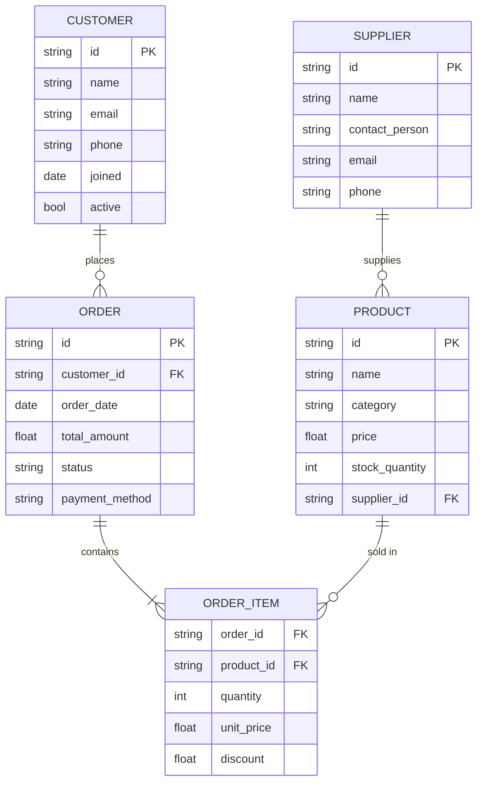
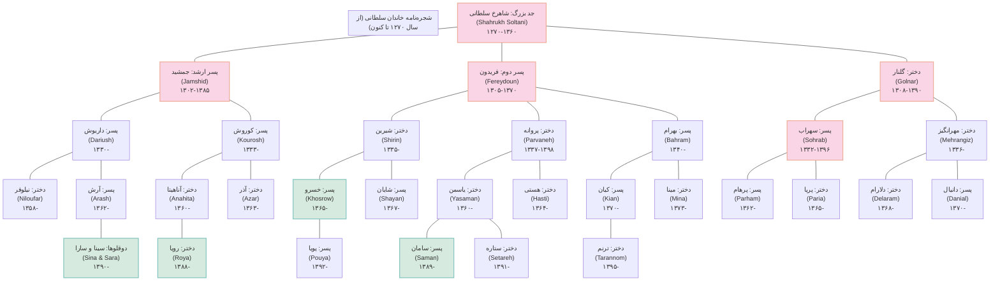

# Mindmap

# DB

```mermaid
erDiagram
    CUSTOMER ||--o{ ORDER : places
    CUSTOMER {
        string id PK
        string name
        string email
        string phone
        date joined
        bool active
    }

    ORDER ||--|{ ORDER_ITEM : contains
    ORDER {
        string id PK
        string customer_id FK
        date order_date
        float total_amount
        string status
        string payment_method
    }

    PRODUCT ||--o{ ORDER_ITEM : "sold in"
    PRODUCT {
        string id PK
        string name
        string category
        float price
        int stock_quantity
        string supplier_id FK
    }

    ORDER_ITEM {
        string order_id FK
        string product_id FK
        int quantity
        float unit_price
        float discount
    }

    SUPPLIER ||--o{ PRODUCT : supplies
    SUPPLIER {
        string id PK
        string name
        string contact_person
        string email
        string phone
    }

```

# Persian Example

```mermaid
graph TD
    A["جد بزرگ: شاهرخ سلطانی\n(Shahrukh Soltani)\n۱۲۷۰-۱۳۶۰"] --- B["پسر ارشد: جمشید\n(Jamshid)\n۱۳۰۲-۱۳۸۵"]
    A --- C["پسر دوم: فریدون\n(Fereydoun)\n۱۳۰۵-۱۳۷۰"]
    A --- D["دختر: گلنار\n(Golnar)\n۱۳۰۸-۱۳۹۰"]

    B --- E["پسر: داریوش\n(Dariush)\n۱۳۳۰-"]
    B --- F["پسر: کوروش\n(Kourosh)\n۱۳۳۳-"]

    C --- G["دختر: شیرین\n(Shirin)\n۱۳۳۵-"]
    C --- H["دختر: پروانه\n(Parvaneh)\n۱۳۳۷-۱۳۹۸"]
    C --- I["پسر: بهرام\n(Bahram)\n۱۳۴۰-"]

    D --- J["پسر: سهراب\n(Sohrab)\n۱۳۳۲-۱۳۹۶"]
    D --- K["دختر: مهرانگیز\n(Mehrangiz)\n۱۳۳۶-"]

    E --- L["دختر: نیلوفر\n(Niloufar)\n۱۳۵۸-"]
    E --- M["پسر: آرش\n(Arash)\n۱۳۶۲-"]

    F --- N["دختر: آناهیتا\n(Anahita)\n۱۳۶۰-"]
    F --- O["دختر: آذر\n(Azar)\n۱۳۶۳-"]

    G --- P["پسر: خسرو\n(Khosrow)\n۱۳۶۵-"]
    G --- Q["پسر: شایان\n(Shayan)\n۱۳۶۷-"]

    H --- R["دختر: یاسمن\n(Yasaman)\n۱۳۶۰-"]
    H --- S["دختر: هستی\n(Hasti)\n۱۳۶۴-"]

    I --- T["پسر: کیان\n(Kian)\n۱۳۷۰-"]
    I --- U["دختر: مینا\n(Mina)\n۱۳۷۳-"]

    J --- V["پسر: پرهام\n(Parham)\n۱۳۶۲-"]
    J --- W["دختر: پریا\n(Paria)\n۱۳۶۵-"]

    K --- X["دختر: دلارام\n(Delaram)\n۱۳۶۸-"]
    K --- Y["پسر: دانیال\n(Danial)\n۱۳۷۰-"]

    M --- Z["دوقلوها: سینا و سارا\n(Sina & Sara)\n۱۳۹۰-"]

    N --- AA["دختر: رویا\n(Roya)\n۱۳۸۸-"]

    P --- AB["پسر: پویا\n(Pouya)\n۱۳۹۲-"]

    R --- AC["پسر: سامان\n(Saman)\n۱۳۸۹-"]
    R --- AD["دختر: ستاره\n(Setareh)\n۱۳۹۱-"]

    T --- AE["دختر: ترنم\n(Tarannom)\n۱۳۹۵-"]

    %% اضافه کردن توضیحات به افراد خاص
    class A,B,C,D,J nodeHighlight
    class P,AA,Z,AC nodeSpecial

    %% تعریف سبک‌ها
    classDef nodeHighlight fill:#f9d5e5,stroke:#eeac99,stroke-width:2px,color:#333
    classDef nodeSpecial fill:#d6eadf,stroke:#83c5be,stroke-width:2px,color:#333

    %% افزودن عنوان و توضیحات
    subgraph "شجره‌نامه خاندان سلطانی (از سال ۱۲۷۰ تا کنون)"
    end

```
