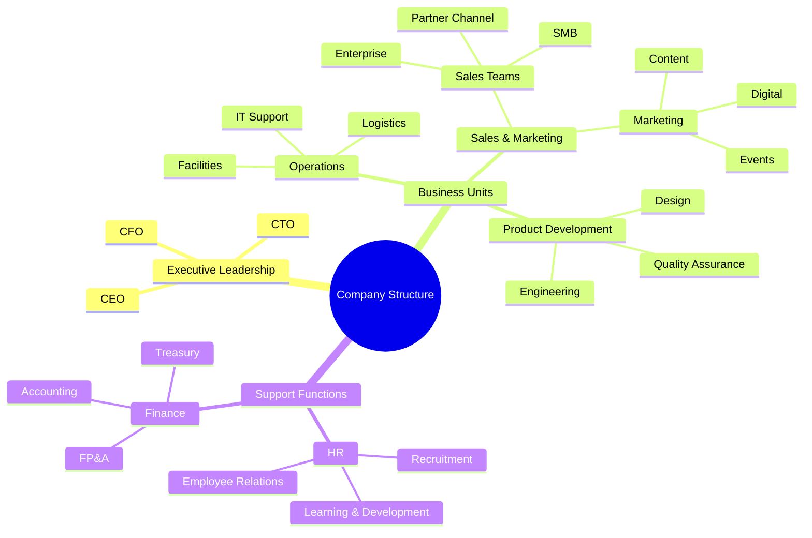
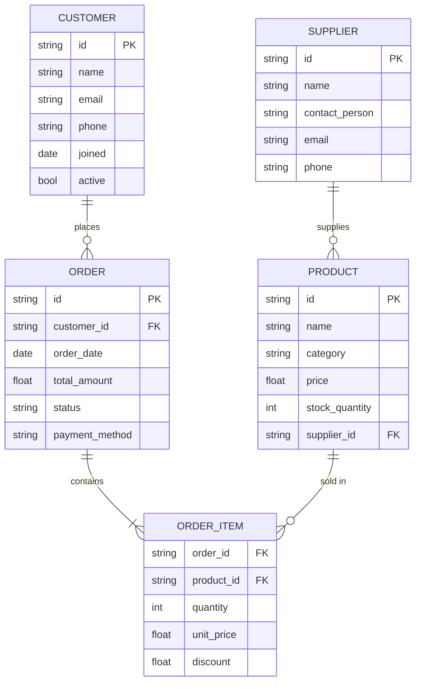

# Mindmap

```mermaid
mindmap
  root((Company Structure))
    Executive Leadership
      CEO
      CFO
      CTO
    Business Units
      Sales & Marketing
        ::icon(fa fa-dollar-sign)
        Sales Teams
          Enterprise
          SMB
          Partner Channel
        Marketing
          ::icon(fa fa-bullhorn)
          Digital
          Events
          Content
      Product Development
        ::icon(fa fa-code)
        Engineering
        Design
        Quality Assurance
      Operations
        ::icon(fa fa-cogs)
        Logistics
        IT Support
        Facilities
    Support Functions
      HR
        ::icon(fa fa-users)
        Recruitment
        Learning & Development
        Employee Relations
      Finance
        ::icon(fa fa-chart-line)
        Accounting
        FP&A
        Treasury
```

# DB

```mermaid
erDiagram
    CUSTOMER ||--o{ ORDER : places
    CUSTOMER {
        string id PK
        string name
        string email
        string phone
        date joined
        bool active
    }

    ORDER ||--|{ ORDER_ITEM : contains
    ORDER {
        string id PK
        string customer_id FK
        date order_date
        float total_amount
        string status
        string payment_method
    }

    PRODUCT ||--o{ ORDER_ITEM : "sold in"
    PRODUCT {
        string id PK
        string name
        string category
        float price
        int stock_quantity
        string supplier_id FK
    }

    ORDER_ITEM {
        string order_id FK
        string product_id FK
        int quantity
        float unit_price
        float discount
    }

    SUPPLIER ||--o{ PRODUCT : supplies
    SUPPLIER {
        string id PK
        string name
        string contact_person
        string email
        string phone
    }

```
