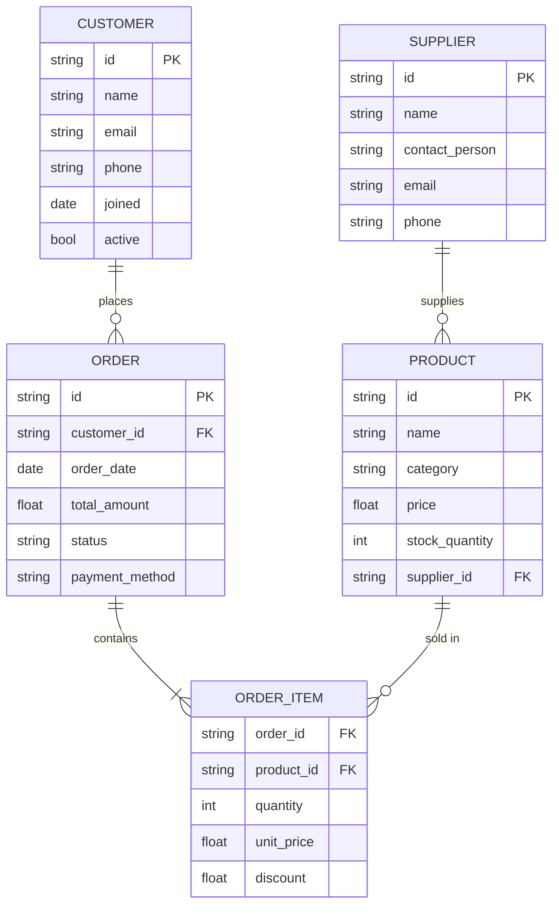
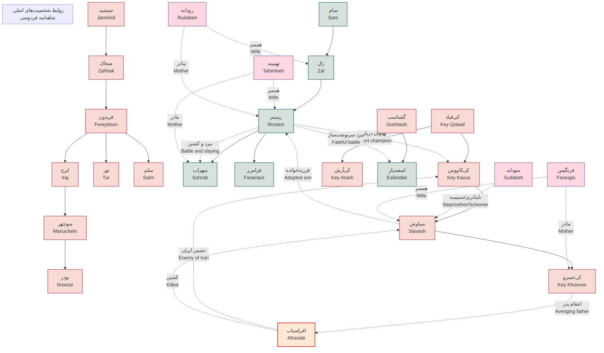

# Mindmap

# DB

```mermaid
erDiagram
    CUSTOMER ||--o{ ORDER : places
    CUSTOMER {
        string id PK
        string name
        string email
        string phone
        date joined
        bool active
    }

    ORDER ||--|{ ORDER_ITEM : contains
    ORDER {
        string id PK
        string customer_id FK
        date order_date
        float total_amount
        string status
        string payment_method
    }

    PRODUCT ||--o{ ORDER_ITEM : "sold in"
    PRODUCT {
        string id PK
        string name
        string category
        float price
        int stock_quantity
        string supplier_id FK
    }

    ORDER_ITEM {
        string order_id FK
        string product_id FK
        int quantity
        float unit_price
        float discount
    }

    SUPPLIER ||--o{ PRODUCT : supplies
    SUPPLIER {
        string id PK
        string name
        string contact_person
        string email
        string phone
    }

```

# Persian Example

```mermaid
flowchart TD
    %% شاهان و پهلوانان اصلی
    A["جمشید\nJamshid"] --> B["ضحاک\nZahhak"]
    B --> C["فریدون\nFereydoun"]
    C --> D["ایرج\nIraj"]
    C --> E["تور\nTur"]
    C --> F["سلم\nSalm"]

    D --> G["منوچهر\nManuchehr"]
    G --> H["نوذر\nNowzar"]

    %% خاندان رستم
    I["سام\nSam"] --> J["زال\nZal"]
    J --> K["رستم\nRostam"]
    K --> L["سهراب\nSohrab"]
    K --> M["فرامرز\nFaramarz"]

    %% شاهان کیانی
    N["کی‌قباد\nKey Qobad"] --> O["کی‌کاووس\nKey Kavus"]
    O --> P["سیاوش\nSiavash"]
    P --> Q["کی‌خسرو\nKey Khosrow"]
    N --> R["کی‌آرش\nKey Arash"]

    %% روابط دیگر
    K -.-> |"نبرد و کشتن"\nBattle and slaying| L
    K -.-> |"پهلوان دربار"\nCourt champion| O
    P -.-> |"فرزندخوانده"\nAdopted son| K

    %% اسفندیار و گشتاسب
    S["گشتاسب\nGoshtasb"] --> T["اسفندیار\nEsfandiar"]
    K -.-> |"نبرد سرنوشت‌ساز"\nFateful battle| T

    %% دشمنان
    U["افراسیاب\nAfrasiab"] -.-> |"دشمن ایران"\nEnemy of Iran| O
    U -.-> |"کشتن"\nKilled| P
    Q -.-> |"انتقام پدر"\nAvenging father| U

    %% زنان مهم شاهنامه
    V["تهمینه\nTahmineh"] -.-> |"همسر"\nWife| K
    V -.-> |"مادر"\nMother| L
    W["سودابه\nSudabeh"] -.-> |"نامادری/دسیسه"\nStepmother/Schemer| P
    X["رودابه\nRudabeh"] -.-> |"همسر"\nWife| J
    X -.-> |"مادر"\nMother| K
    Y["فرنگیس\nFarangis"] -.-> |"همسر"\nWife| P
    Y -.-> |"مادر"\nMother| Q

    %% استایل‌ها
    classDef shahsStyle fill:#f9dcd5,stroke:#c06c84,stroke-width:2px,color:#333
    classDef pahlavanStyle fill:#d8e2dc,stroke:#588b8b,stroke-width:2px,color:#333
    classDef enemyStyle fill:#ffe8d6,stroke:#d62828,stroke-width:2px,color:#333
    classDef womenStyle fill:#ffd8e4,stroke:#9f86c0,stroke-width:2px,color:#333

    %% اعمال استایل‌ها
    class A,B,C,D,E,F,G,H,N,O,P,Q,R,S shahsStyle
    class I,J,K,L,M,T pahlavanStyle
    class U enemyStyle
    class V,W,X,Y womenStyle

    %% عنوان
    subgraph "روابط شخصیت‌های اصلی شاهنامه فردوسی"
    end

```
